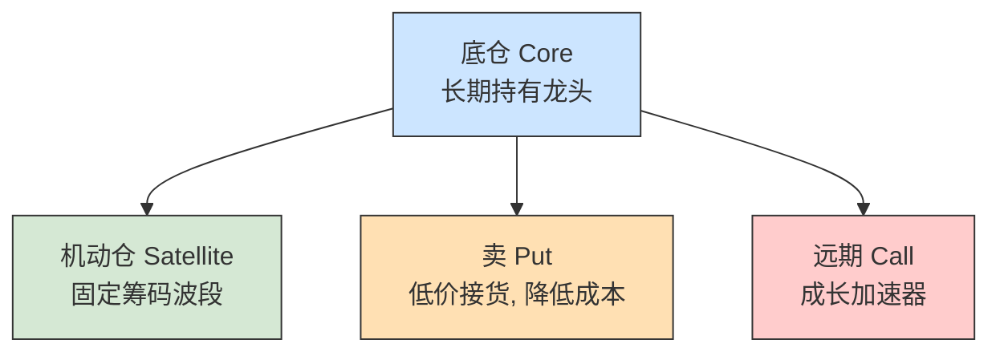

## 引言

在投资市场中，投资风格大致可以分为几类：价值型、成长型、趋势投机型，或两者之间的混合型。不同风格对应着不同的决策逻辑，都面临一个共同问题——如何处理市场波动。价值投资者在市场下跌时容易陷入焦虑，成长投资者往往因追涨杀跌而被动，趋势投机者虽然积极，但常因节奏失误而损失惨重。

对于价值投资者而言，最大挑战往往是“股价下跌但基本面无虞”的阶段，此时需要极强的耐心和信心；而成长型投资者则容易在高波动中反复追涨杀跌，难以长期拿住趋势。趋势投机者更直接，波动即机会，但也往往因为节奏失误而损失惨重。

作为严格意义上的 **“价值成长投资者”**，本人始终坚持只做行业龙头，不碰垃圾股。我的逻辑并非单纯的“拿住龙头，时间会给回报”，而是强调两个核心：
**一是成长性，二是持仓成本**。

## 一、从被动风险到主动管理

价值投资的真正困境并不在选股逻辑，而在心理层面：当只是被动持有时，风险完全由市场决定；而当尝试主动波段时，又容易陷入“卖飞焦虑”。这种矛盾，正是本人投资心智成长的起点，也让我在心理上逐渐完成了从被动承受波动到主动管理风险的转变。

最初，作者和大多数价值投资者一样，买入龙头后长期持有。但这种方式虽然正确，却意味着完全被市场波动所支配：上涨时只能被动享受，下跌时只能被动承受。
我逐渐意识到仅凭“信仰”不足以支撑长期操作，于是开始采用仓位分层的思路进行风险管理：

- **底仓（约 80–85%）**：长期持有，不因波动而调整，专注趋势和成长兑现；
- **机动仓（约 15–20%）**：固定筹码，用于波段操作，通过高抛低吸来主动降低成本。

这样的组合使风险从“被动承受”变为“部分可控”。即便出现“卖飞”，那也只是少赚，而非真正亏损；底仓依旧确保了长期性。风险不再是纯粹的市场赋予，而是可以通过操作部分掌控：

- 上涨 → 底仓确保长期收益；
- 下跌 → 机动仓提供补仓机会；
- 卖飞 → 只是机会成本，底仓依然在。

## 二、价值投资的进阶

传统的龙头投资逻辑，本质上是一种被动价值投资：买入龙头、长期持有、依赖时间兑现价值。其优势是确定性，但局限在于：

1. **成本锁死**：持仓成本一旦形成，无法主动改善；
2. **心理被动**：在回撤中完全依赖“信仰”，缺乏操作支撑。

本人的逻辑可以看作是价值投资的进阶，建立在两个核心理念之上：

- **成长性**  
  龙头之所以值得长期持有，是因为要么身处趋势明确的新兴行业（新能源、半导体、机器人），要么位于模式稳定的永续行业（电力、银行），能提供长期复利。长期持有的基础在于成长，而不是静态的安全。

- **动态降低成本**  
  本人不接受只能被动承受波动。通过机动仓的波段操作与卖 Put 策略，我把市场波动转化为摊低成本的机会，使安全边际在动态过程中不断增强。

这种方式既保留了价值投资的长期性，又融入成长投资的进取性，并加入了主动风险管理的维度。

## 三、行业选择：新兴与永续

作为价值投资者，我通常只投资两类行业：趋势明确的新兴行业，以及模式稳定的永续行业。

- **新兴成长型**：趋势明确、空间巨大，如固态电池、半导体国产替代、人形机器人。
- **永续稳定型**：现金流与分红稳定，如电力、储能、银行。

| 分类        | 行业示例      | 投资逻辑             | 策略执行                   | 心态定位           |
|-----------|-----------|------------------|------------------------|----------------|
| **新兴成长型** | 新能源（固态电池） | 技术升级方向，渗透率持续提升   | 配置研发/量产能力最强的龙头，不碰概念小票  | 波动大，机动仓必不可少    |
|           | 半导体国产替代   | 国家战略兜底，产业必然补短板   | 选择关键环节龙头（设备、材料、代工、EDA） | 短期波动剧烈，但长期确定性强 |
|           | 人形机器人     | 初期赛道，但趋势笃定       | 提前卡位潜在龙头，轻仓布局          | 视为“成长筹码”，仓位轻   |
| **永续稳定型** | 电力（发电+储能） | 刚性需求，新能源并网驱动储能   | 配置发电/储能龙头，分红+波段        | 确定性高，底仓为主      |
|           | 银行        | 行业壁垒强，分红稳定，现金流稳健 | 作为组合稳定器，摊低整体成本         | 安全边际厚，波动小      |  

## 四、操作心法

1. **不做空**：胜率低，风险大，与只投优质股的逻辑相悖。
2. **不卖 Call**：上涨被封顶，心理难以接受，与长期多头信仰冲突。
3. **卖 Put**：契合价投理念。不被行权 → 收权利金降低成本；被行权 → 低价买入龙头。
4. **波段纪律**：机动仓固定筹码，只做中段波动，不追求抄底摸顶；盈利落袋后逐步转化为底仓。

## 五、远期 Call：成长加速器

对于长期极度看好的标的，如果短期不想过度加仓，本人会配置少量 **远期 Call（LEAPS）**。

- **逻辑**：小额资金撬动长期成长，成功时收益放大，失败时损失有限。
- **条件**：只选龙头，仓位不超过 5–10%。
- **执行**：
    1. 选择 1–2 年以上到期日，给足成长兑现时间；
    2. 行权价选取合理价外，避免深虚值；
    3. 标的限定为确定性极高的龙头。

远期 Call 是非对称工具：小亏有限，大赚极高，是组合的成长加速器。

## 六、投资四层架构图

- **底仓（Core）**：组合核心，占比 70–85%。
- **机动仓（Satellite）**：波段操作，摊低整体成本。
- **卖 Put**：增强安全边际，低价接货或收权利金。
- **远期 Call**：小比例仓位，博取趋势兑现时的高弹性。

## 七、心理成长曲线

- **阶段一**：卖飞焦虑，情绪主导。
- **阶段二**：理解卖飞=机会成本，少赚不等于亏损。
- **阶段三**：分仓思维，底仓吃趋势，机动仓摊成本。
- **阶段四**：主动控险，把波动转化为主动权。

## 八、结语

本人的投资逻辑可以总结为：  
**龙头底仓赚确定性；机动仓降低成本，把波动转化为安全边际；卖 Put 打折接货；远期 Call 撬动长期成长。**

这是一种从传统价值投资进阶而来的方式。它不再依赖“信仰”去熬，而是依靠成长逻辑与方法论来控制风险并放大收益。真正的进步，不仅是收益曲线的改善，更体现在投资心智的成熟。

