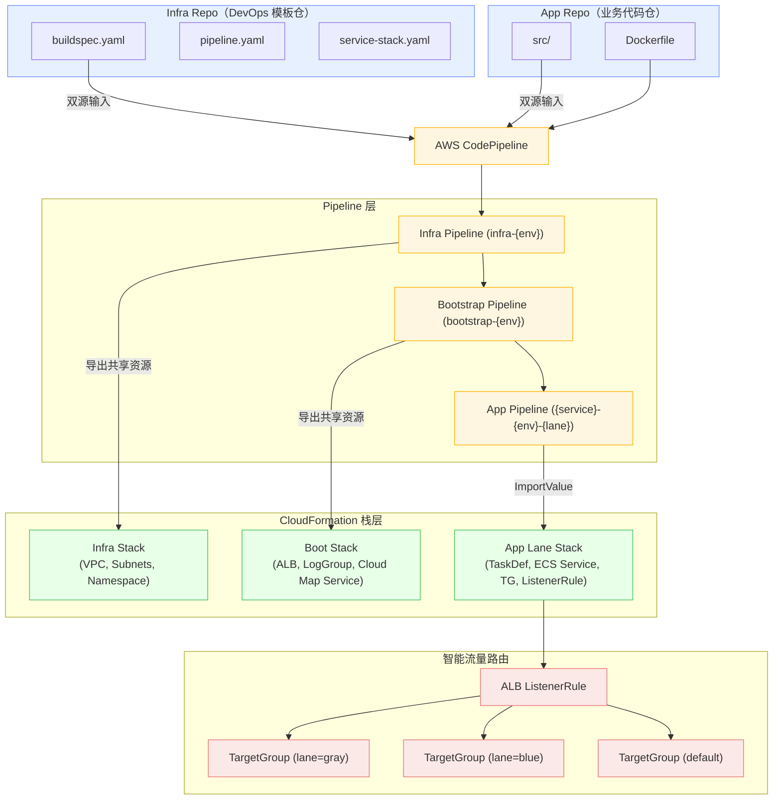

> 本文面向 DevOps 架构师与云原生工程师，介绍如何基于 **AWS CodePipeline + CloudFormation** 构建一套支持多泳道（Multi-Lane）并行部署的**ECS 持续交付体系**。  
> 该方案不仅解决并发部署的资源锁冲突问题，还实现模板集中治理与业务仓库完全解耦。

## 一、背景与痛点：当 DevOps 模板失控

在多数微服务项目中，随着服务数量增加、环境层次复杂化，CI/CD 模板往往会失控：

- 各服务仓库内各自维护一份 buildspec、pipeline、CFN 模板；
- 模板更新无法统一发布；
- 资源命名与导出不一致；
- 多泳道部署（如灰度、蓝绿）存在栈级锁冲突；
- 模板合规性无法集中审计。

**问题本质：** DevOps 模板分散，难以统一演进与治理。

在这种背景下，我们设计了一个具备“集中模板治理 + 并发部署能力”的体系：  
**双仓 + 三层 Pipeline + Lane 栈隔离**，下图展示了多泳道 CI/CD 的分层架构设计。



## 二、核心理念：双仓 + 三层 + Lane 栈

整个体系的设计核心是三个关键词：**双仓、分层、泳道（Lane）**。

### 1. 双仓架构：逻辑分治

| 仓库类型       | 内容职责                                 | 示例                                                     |
|------------|--------------------------------------|--------------------------------------------------------|
| Infra Repo | 统一的 DevOps 模板、buildspec、CFN 栈模板、脚本工具 | ci/buildspec.yaml, ci/app/templates/service-stack.yaml |
| App Repo   | 业务代码与配置、Dockerfile、服务逻辑              | src/, Dockerfile                                       |

实现机制：**双源输入（Dual-Source Inputs）**

在 Pipeline 的 Source 阶段输出两个 Artifact：

- Name: InfraSource → OutputArtifacts: [InfraOut]
- Name: AppSource → OutputArtifacts: [AppOut]

Build 阶段以 InfraOut 为主输入（含统一 buildspec），AppOut 为副输入（含业务代码）。  
CodeBuild 会自动挂载环境变量：

- `$CODEBUILD_SRC_DIR` → InfraOut
- `$CODEBUILD_SRC_DIR_AppOut` → AppOut

这样，所有服务共用一套 CI/CD 模板，DevOps 团队统一维护，App 团队只关注业务逻辑。

### 2. 三层 Pipeline 架构：职责分层 + 无锁部署

整个系统通过 **三层 Pipeline 架构** 实现部署解耦与并行化：

- **infra 层**：负责环境通用基础设施（VPC、子网、ECS Cluster、Cloud Map 命名空间）。
- **boot 层**：统一管理负载均衡、日志、注册发现等**服务接入设施**。
- **app 层**：负责具体服务的泳道级部署（TaskDefinition、ECS Service、ListenerRule）。

| 层级  | Pipeline 命名     | 管理资源                                        | Pipeline 变量                          | 更新频率  | 并发特性  |
|-----|-----------------|---------------------------------------------|--------------------------------------|-------|-------|
| 环境级 | infra-{env}     | VPC、Subnets、ECS Cluster、Cloud Map Namespace | `ENV=dev`                            | 几乎不变  | 独立运行  |
| 服务级 | boot-{env}      | ALB、LogGroup、Cloud Map Service              | `ENV=dev,SERVICE=user-api`           | 新服务接入 | 按服务并行 |
| 应用级 | {service}-{env} | TaskDefinition、ECS Service、TG、ListenerRule  | `ENV=dev,SERVICE=user-api,LANE=gray` | 高频发布  | 按泳道并行 |

其中，`bootstrap-{env}` 是**按环境聚合的通用服务层**，而非按服务拆分。它本身不绑定单一服务，而是通过 **Pipeline
变量 `SERVICE`**
动态生成服务相关资源。

系统分层设计的最大优势在于：**部署互不加锁、并发天然安全。**

#### 🔹 栈级并行的核心逻辑

CloudFormation 的锁粒度是 **Stack 级别**。  
系统通过“分层 + 多栈 + 命名隔离”的方式实现以下特性：

1. **同层可并行**
    - 每个环境（infra）、服务（boot）、泳道（app-lane）都对应独立的 Stack。
    - 不同 Stack 的资源命名与写集完全隔离，因此可以**同时执行更新**，互不加锁。
    - 例如多个泳道（gray、blue、default）在同一服务下可并行部署，各自占用自己的 Stack 锁。

2. **跨层有序**
    - 上层 Pipeline 仅**依赖下层的导出值（Outputs/ImportValue）**，不会修改下层资源。
    - 这意味着：
        - `infra` 栈先创建网络与集群并导出；
        - `boot` 栈读取导出创建 ALB、Service；
        - `app` 栈读取 ListenerArn、TargetGroup 等信息完成发布。
    - **依赖有序但无写冲突**，下层更新完即可被上层安全引用。

3. **整体效果：并行 + 无锁 + 可控依赖**
    - 同层之间可并发部署（服务与泳道互不干扰）；
    - 跨层之间按依赖顺序执行（无资源竞争）；
    - 实现了从底层网络到业务服务的**全链路高并发、零锁冲突的交付体系**。

> 简而言之：**同层多栈并行，跨层只读依赖。**  
> 这正是实现高并发、零冲突持续交付的关键机制。

# 3. Lane 栈：并发部署的关键

在传统的 ECS 部署模型中，一个服务通常绑定到单个 **ECS Service**。  
这意味着任意时刻只能存在一个“活动版本”——更新时只能通过滚动更新或替换任务的方式发布新版本。  
这种模型虽然简单，但存在明显瓶颈：

- 无法在同一时间维护多个版本共存（例如灰度、蓝绿或 A/B 测试）。
- 每次部署会锁定整个 Service 资源，无法并发执行。
- 流量控制、回滚、实验发布都需要额外逻辑或外部流量网关。

为了解决这些问题，系统引入了 **Lane（泳道）栈模型**。

## 🧩 设计核心：Lane = 独立生命周期的“版本栈”

Lane 栈的设计思想是：
> **一个 Lane 表示一个版本上下文（Version Context）**，  
> 包含该版本的 ECS Service、TargetGroup、ListenerRule 等资源，  
> 并通过 Header 或 Context 选择性路由流量。

因此：

- 每个 Lane 就像一个“并行世界”的独立 Service 实例；
- 各个 Lane 拥有独立的资源、独立的生命周期；
- 流量通过路由规则（如 tracestate header）智能分发。

例如：

| Lane    | 栈名                       | Service 名称           | TargetGroup  | 路由条件                     |
|---------|--------------------------|----------------------|--------------|--------------------------|
| default | app-user-api-dev-default | user-api-dev-default | *-default-tg | 默认                       |
| gray    | app-user-api-dev-gray    | user-api-dev-gray    | *-gray-tg    | tracestate=ctx=lane:gray |
| blue    | app-user-api-dev-blue    | user-api-dev-blue    | *-blue-tg    | tracestate=ctx=lane:blue |

每个泳道的 CloudFormation Stack 定义为：

```yaml
StackName: !Sub 'app-${Service}-${Env}-${Lane}'
Resources:
  Service:
    Type: AWS::ECS::Service
    Properties:
      ServiceName: !Sub '${Service}-${Env}-${Lane}'
  TargetGroup:
    Type: AWS::ElasticLoadBalancingV2::TargetGroup
    Properties:
      Name: !Sub '${Service}-${Env}-${Lane}-tg'
  ListenerRule:
    Type: AWS::ElasticLoadBalancingV2::ListenerRule
    Properties:
      Conditions:
        - Field: http-header
          HttpHeaderConfig:
            HttpHeaderName: tracestate
            Values: [ !Sub 'ctx=lane:${Lane}' ]
      Actions:
        - Type: forward
          TargetGroupArn: !Ref TargetGroup
```

## ⚙️ Lane 栈的四个核心特性

1. **完全隔离的栈级资源**
    - 每个 Lane 拥有独立的 ECS Service、TargetGroup、ListenerRule。
    - 任何一个 Lane 的更新、失败或回滚都不会影响其他泳道。
    - 删除 Lane 栈即可完成资源自动清理，无需手动回收 TG 或 ListenerRule。

2. **天然支持并发部署**
    - 因为每个 Lane 是独立的 CloudFormation 栈（Stack 级锁粒度），  
      所以不同 Lane 的部署可**并行执行**，互不阻塞。
    - 这也是实现“高并发无锁部署”的关键基础。

3. **动态可扩展的路由结构**
    - ALB Listener 只需配置一次；
    - 每个 Lane 栈在创建时向 Listener 动态注册一条规则；
    - 新增泳道无需修改主栈结构，只需部署新 Lane 栈；
    - 删除泳道时自动删除对应规则与 TG，保持路由整洁。

4. **从工程到业务的统一抽象**
    - 工程层面，Lane 栈解决了**部署并发与模板复用**问题；
    - 业务层面，Lane 栈提供了**流量分层与发布控制**能力；
    - 从架构设计上，让**灰度、蓝绿、A/B 测试成为原生特性**，而不是附加逻辑。

## 🚀 Lane 驱动的发布模式

| 模式                        | 描述                              | 实现方式                             |
|---------------------------|---------------------------------|----------------------------------|
| **灰度发布（Gray Release）**    | 在新版本泳道 gray 中发布少量流量进行验证         | 新建 gray Lane 栈并部分流量注入（header/比例） |
| **蓝绿发布（Blue/Green）**      | 两个版本（blue / default）并行，流量逐步切换   | 部署 blue Lane 栈 → 切换流量 → 删除旧栈     |
| **A/B 测试（Traffic Split）** | 按 header、cookie 或用户 ID 维度路由不同版本 | 多个 Lane 并行存在，ALB 或应用层控制 header   |

Lane 机制使得部署逻辑、流量策略、回滚策略都在架构层可编排，而不是由业务代码实现。它本质上是一种基于 **CloudFormation
Stack 粒度的多版本并行架构**，通过「多栈并行 + 独立路由 + 参数化部署」实现：

- 高并发发布（无锁冲突）
- 多版本共存（灰度、蓝绿、A/B）
- 一键清理与回滚
- 模板级治理与可审计性

## 三、技术实现：从模板到执行

### 1. BuildSpec：统一入口，逻辑外移

所有服务共用统一构建描述文件 `ci/buildspec.yaml`：

```yaml
version: 0.2
env:
  shell: bash
  variables:
    MODULE_PATH: "."                  # 相对"应用仓根目录"（AppOut）
  # 跨 phase 变量传递
  exported-variables:
    - ECR_REPO_URI
    - IMAGE_TAG_URI

phases:
  install:
    runtime-versions:
      java: corretto21
    commands:
      - chmod +x ci/*.sh
  pre_build:
    commands:
      - '. ci/build.sh; prebuild'
  build:
    commands:
      - '. ci/build.sh; build'
  post_build:
    commands:
      - '. ci/build.sh; postbuild'
artifacts:
  files:
    - cfn-params.json   # 从主输入根目录打包
```

实际逻辑集中在 `ci/build.sh`：

```bash
prebuild() {
  aws ecr get-login-password | docker login ...
}
build() {
  docker build -t $SERVICE_NAME .
  docker push $ECR_URI/$SERVICE_NAME:$IMAGE_TAG
}
postbuild() {
  echo "{"Parameters":{"ImageUri":"$ECR_URI/$SERVICE_NAME:$IMAGE_TAG"}}" > cfn-params.json
}
```

这种“轻 buildspec + 重脚本”的结构极大增强了模板复用性与可审计性。

### 2. 栈设计：Infra → Boot → App

#### (1) Infra 栈（环境级共享）

```yaml
Parameters:
  CreateNetwork:
    Type: String
    Default: 'true'

Conditions:
  CreateNetworkCond: !Equals [ !Ref CreateNetwork, 'true' ]

Resources:
  VPC:
    Type: AWS::EC2::VPC
    Condition: CreateNetworkCond

  Namespace:
    Type: AWS::ServiceDiscovery::PrivateDnsNamespace

Outputs:
  VpcId:
    Value: !Ref VPC
    Export:
      Name: !Sub 'infra-environment-${Env}-VpcId'
```

若已存在网络，可设置 `CreateNetwork=false` 进入 Wrap 模式：仅包装已有 VPC/Subnets 并导出 ID。

#### (2) Boot 栈（服务级）

负责创建：

- ALB + 默认 TargetGroup + Listener；
- LogGroup；
- Cloud Map Service。

导出值：

```
boot-user-api-dev-LoadBalancerArn
boot-user-api-dev-HttpListenerArn
boot-user-api-dev-LogGroupName
boot-user-api-dev-user-api-service-arn
```

#### (3) App 栈（泳道级）

创建：

- TaskDefinition；
- ECS Service；
- TargetGroup；
- ListenerRule（Header 匹配 lane）。

```yaml
Conditions:
  IsGray: !Equals [ !Ref Lane, 'gray' ]
LaneRule:
  Type: AWS::ElasticLoadBalancingV2::ListenerRule
  Properties:
    ListenerArn: !ImportValue boot-${ServiceName}-${Env}-HttpListenerArn
    Priority: 1000
    Conditions:
      - Field: http-header
        HttpHeaderConfig:
          HttpHeaderName: tracestate
          Values: [ !Sub 'ctx=lane:${Lane}' ]
    Actions:
      - Type: forward
        TargetGroupArn: !Ref LaneTargetGroup
```

## 四、参数与权限：闭环与最小授权

### 1. 参数闭环

```bash
# Pipeline 触发变量
LANE=gray BRANCH=release/1.2.3

# CodeBuild 环境变量
SERVICE_NAME=user-api APP_ENV=dev

# 输出参数文件
{
  "Parameters": {
    "ServiceName": "user-api",
    "Env": "dev",
    "Lane": "gray",
    "ImageUri": "xxx.dkr.ecr.ap-southeast-2.amazonaws.com/user-api:sha-abc123"
  }
}
```

### 2. 权限边界

App Pipeline 的 IAM 策略：

```json
[
  {
    "Effect": "Allow",
    "Action": "cloudformation:*",
    "Resource": "arn:aws:cloudformation:*:*:stack/app-*/*"
  },
  {
    "Effect": "Deny",
    "Action": "cloudformation:*",
    "Resource": [
      "arn:aws:cloudformation:*:*:stack/boot-*/*",
      "arn:aws:cloudformation:*:*:stack/infra-environment-*/*"
    ]
  }
]
```

Stack Policy 保护：

- 禁止修改 Boot 栈 Listener、证书；
- 禁止删除 Infra 栈网络资源。

## 五、流量路由与灰度策略

### 1. Trace Context 驱动的智能路由

系统遵循 W3C Trace Context 标准，在 tracestate 中注入 lane 信息：

```
tracestate: ctx=lane:gray
```

ALB 按 Header 匹配：

- 命中 → 转发到对应 TG；
- 未命中 → 回退至 default TG。

### 2. 典型灰度流程

1. 触发新 Lane：`LANE=gray`
2. 发布 `app-user-api-dev-gray`
3. 小流量 Header 导入 gray；
4. 验证稳定后，将 gray 升级为 default；
5. 删除旧 Lane 栈。

整个流程无须改 ALB 或共享层，完全自动化。

## 六、可观测性与回滚机制

### 1. 日志聚合

每个服务在 Boot 栈创建 `/ecs/{env}/{service}` LogGroup；  
每 Lane 使用独立 `stream-prefix={lane}`，实现多维检索。

### 2. 自动回滚

ECS Deployment Circuit Breaker 自动检测：

- 部署失败时回滚至上个 TaskRevision；
- 发布脚本支持一键重发上个镜像标签。

### 3. 监控指标

| 类别  | 指标                          | 告警条件   |
|-----|-----------------------------|--------|
| ALB | HTTPCode_Target_5XX_Count   | > 1%   |
| ECS | RunningCount < DesiredCount | 连续 3 次 |
| TG  | HealthyHostCount            | < 1    |

## 七、实施与价值

下面展示如何基于 AWS CloudFormation 和 CodePipeline 部署多层持续交付体系， 并通过 JSON 文件定义模板参数，实现模板集中治理与参数可审计。

### 1. 部署pipeline（一次性）

```bash
# 环境级（一次性部署）
aws cloudformation deploy \
  --template-file ci/infra/pipeline.yaml \
  --stack-name infra-dev \
  --parameter-overrides file://params/infra-dev.json

# 服务接入层 boot（一次性部署，通用 pipeline）
aws cloudformation deploy \
  --template-file ci/boot/pipeline.yaml \
  --stack-name bootstrap-dev \
  --parameter-overrides file://params/bootstrap-dev.json

# 应用层 app（每个服务独立一条 pipeline）
aws cloudformation deploy \
  --template-file ci/app/pipeline.yaml \
  --stack-name user-api-dev \
  --parameter-overrides file://params/user-api-dev.json
```

### 2. 参数文件

每个阶段都在 params/ 目录下定义独立 JSON 参数文件，按规范区分环境、服务与泳道：

| 层级  | 参数文件                   | 示例                  | 用途                                                        |
|-----|------------------------|---------------------|-----------------------------------------------------------|
| 环境级 | `infra-{env}.json`     | `infra-dev.json`    | 基础设施参数，定义基础网络、VPC、Subnet、Cluster、Namespace 等通用资源。         |
| 服务级 | `boot-{env}.json`      | `boot-dev.json`     | 服务引导参数，通过运行时变量 `SERVICE` 来动态创建各服务的 ALB、LogGroup、Cloud Map |
| 应用级 | `{service}-{env}.json` | `user-api-dev.json` | 应用层参数，每个服务一份独立参数文件，支持通过SERVICE、LANE、BRANCH 变量控制泳道部署与镜像版本。 |

> 这种命名约定便于版本化与审计，也可在 CodePipeline 中动态选择。所有参数文件统一存放在 `params/` 目录中，并纳入 Git 版本管理，
> 便于在不同环境间复用、审计、回滚与自动化生成。

### 3. 服务引导（服务级共享资源）

在部署 **应用层 pipeline**（如 `user-api-dev`）之前，必须先触发一次**boot 层通用 pipeline（boot-{env}）**，以创建该服务的共享接入资源：

- ALB TargetGroup
- Cloud Map Service
- LogGroup
- 默认 ListenerRule

这些资源由 boot 层集中管理，所有应用层泳道（如 gray、blue、default）都会复用，因此必须保证该阶段先于 **app pipeline** 执行。

```bash
# 使用 bootstrap-dev pipeline，通过 SERVICE 参数创建服务接入资源
aws codepipeline start-pipeline-execution \
  --name boot-dev \
  --variables name=SERVICE,value=user-api
```

### 4. 发布与泳道管理（app 层）

```bash
# 发布到 gray 泳道
aws codepipeline start-pipeline-execution \
  --name user-api-dev \
  --variables name=SERVICE,value=user-api \
              name=LANE,value=gray \
              name=BRANCH,value=release/1.2.3

# 删除 gray 泳道（自动回收 TG/ListenerRule/ECS Service）
aws cloudformation delete-stack \
  --stack-name app-user-api-dev-gray
```

### 3. 价值总结

- 使用 `params/` 目录集中存放模板参数，配合 Git 版本管理。
- 参数文件与模板解耦，方便在不同环境间复用相同模板。
- 通过 CodePipeline 的变量参数（如 `SERVICE`、`LANE`、`BRANCH`）控制发布粒度。
- 删除泳道时只需删除对应 Stack，系统会自动回收资源。
- 在多泳道部署中保持命名一致性与参数规范，确保各层之间可审计、可追溯。

| 维度     | 成果                          |
|--------|-----------------------------|
| **技术** | 无锁并发部署、模板集中治理、智能流量路由        |
| **运维** | 零人工泳道切换、标准化监控与自动回滚          |
| **业务** | 快速灰度 / 蓝绿 / A/B 测试，显著缩短发布周期 |
| **治理** | 模板合规集中、权限最小化、栈保护机制，支持统一审计   |

> ✅ 通过以上实践，整个 CI/CD 体系实现了模板化、参数化、自动化、可治理化，  
> 让“多泳道高并发交付”成为一种工程标准，而非复杂特例。

## 结语：从流程到体系

该架构的核心思想是“让 CI/CD 自治，而非依赖人治”，通过：

- 模板集中治理（Infra Repo）
- 业务仓独立演进（App Repo）
- Pipeline 分层解耦
- Lane 栈级并发隔离

我们不仅在工程上解决了并发冲突和灰度复杂度， 更在组织层面建立了 DevOps 模板的统一“基建层”。
**DevOps 模板不再是脚本集合，而是服务化的基础设施。**
