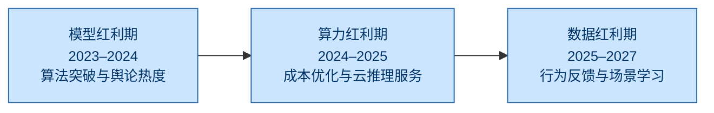
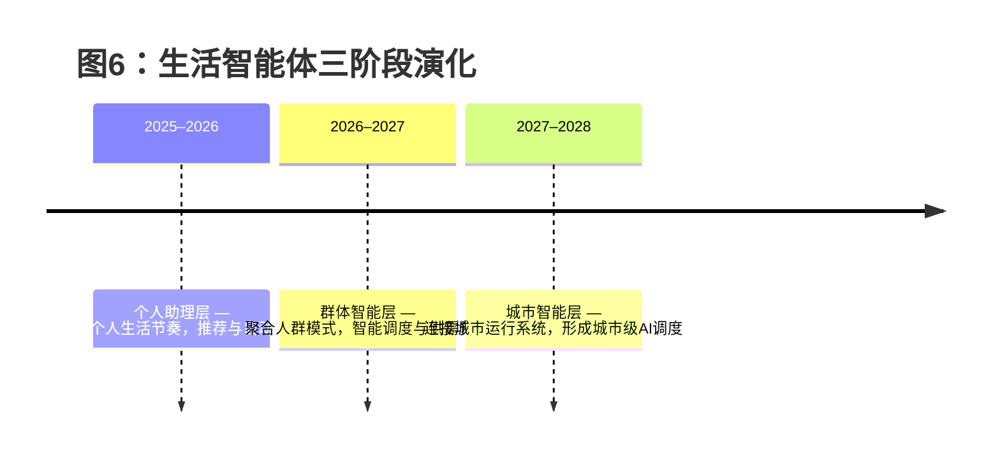
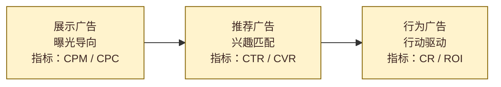

## 一、AI的分水岭：从聪明的模型到懂人的系统

过去两年是人工智能的“军备时代”。全球科技公司在模型规模、参数数量、GPU算力等方面展开了前所未有的竞赛。ChatGPT、Claude、通义千问、文心一言相继问世，成为企业战略层面的必答题。然而，到了2025年，这场狂热逐渐降温。模型性能的差距在缩小，算力逐步商品化，边际收益开始下降，AI的“聪明”不再稀缺。企业用户发现，推理成本、延迟和合规性才是决定商业化成败的关键因素。

AI上半场的红利来自算法，而下半场的红利来自理解。真正决定竞争力的，不是模型的规模，而是系统能否读懂人、理解世界并参与现实决策。AI的价值焦点，正在从“生成语言”转向“生成行为”，从“表达智能”转向“行动智能”。未来的胜负，不再取决于模型参数的多少，而取决于谁能构建出真正懂人的系统。

## 二、AI商业化的迁移：算法红利、算力红利与数据红利

AI的商业化进程，实际上是智能价值链的迁移过程。2023至2024年是“模型红利期”，行业的驱动力主要来自算法突破与舆论热度，资本市场以技术能力为估值核心，代表企业包括OpenAI、百度和Anthropic。进入2024至2025年，AI步入“算力红利期”，成本优化与推理供给成为核心变量，云平台型企业如阿里云、腾讯云和AWS成为主导力量。到2025年之后，AI进入“数据红利期”，竞争焦点转向真实场景、行为反馈和用户画像的学习能力，美团、腾讯、滴滴等拥有高频闭环数据的公司将成为新的增长引擎。

AI的价值重心因此从“算力驱动”转向“数据驱动”。当算法趋同时，数据的质量、反馈速度和真实性成为衡量AI智能深度的核心指标。谁能掌握最全面、最真实、反馈最快的数据生态，谁就能在AI下半场中建立结构性优势。

### 📊 图2：AI商业化阶段演进示意图



## 三、数据的分层：意图、表达与行为

在中国互联网格局中，阿里、腾讯和美团三家公司分别掌握着三种典型的数据类型，构成了AI场景化竞争的三维坐标。阿里的数据代表“意图层”，源自交易与经营体系，反映用户的消费意图与商家行为；腾讯的数据属于“表达层”，以社交关系、内容分发和兴趣标签为主，反映用户的情感表达与社交互动；而美团的数据则处于“行为层”，来源于吃饭、出行、住宿、配送等真实行为，记录用户在现实世界的即时决策。

这三类数据具有不同的结构特征与商业价值。阿里的交易数据结构化程度高、易于标准化建模和直接变现，但频率较低，更多反映的是“买了什么”，而非“为什么买”；腾讯的数据高频且覆盖广，反馈周期快，有助于建模兴趣与传播路径，但由于社交表达的伪装性较强，真实性相对不足；美团的数据最贴近现实，它捕捉的是主动行为而非被动意图，具备闭环性和极高的学习价值。每一笔订单、履约与评价，都是AI的一次现实世界训练样本。也因此，在AI下半场，数据分层的差异，正在决定智能化落地的层次。

## 四、AI价值的函数：D × F × R

当模型性能逐渐收敛时，AI的核心价值可以被近似地表达为一个函数：AI价值 ≈ D（数据规模） × F（反馈频率） ×
R（真实性）。D代表数据的总体规模，F代表反馈速度与更新频率，R代表数据的真实性与可验证程度。三者共同决定了AI的“可学习性”。从这一指标来看，阿里在数据规模上占据绝对优势，腾讯在反馈频率上最强，而美团在真实性与闭环反馈方面遥遥领先。

阿里的AI商业化程度最高，价值兑现率约为60%至70%，属于成熟稳定型结构；腾讯的AI生态处于释放期，广告与小程序交易的渗透率提升带动其价值兑现率达到30%至40%；美团的AI则处于早期积累阶段，商业化比例不足10%，但其学习价值指数最高，达到0.9。这意味着，美团虽然当前盈利贡献有限，但在AI强化学习与真实反馈方面拥有最强的潜在增长空间。

### 📈 图4：AI价值函数对比（D × F × R）

```mermaid
---
title: 图4：AI价值函数对比（D × F × R）
---
radarChart
axes:
- 数据规模 D
- 反馈频率 F
- 真实性 R
datasets:
- label: 阿里
data: [5, 2.5, 4]
- label: 腾讯
data: [5, 5, 3]
- label: 美团
data: [4, 4.5, 5]
```

## 五、ATM的AI路径：从经营智能到现实智能

阿里、腾讯、美团分别代表了AI在中国商业体系中的三种不同方向。阿里的路径是“经营智能化”，依托通义大模型与阿里云，将AI嵌入商家经营系统，实现选品、定价、广告投放和库存预测的智能化。AI在阿里的商业逻辑中扮演的是“企业中枢”的角色，它重构了商家经营的决策方式，提高ROI与利润率，使阿里的AI成为一种稳定的经营变量，而非投机式题材。

腾讯的路径是“生态智能化”，它将AI融入社交、内容和广告系统，形成一个由社交关系驱动的自适应生态。混元模型提升了腾讯在广告归因、视频推荐和小程序交易化方面的能力，AI让广告从“展示逻辑”转为“转化逻辑”，让微信生态的商业密度进一步提升。腾讯的AI不是制造新的增长，而是延长既有生态的生命周期，是典型的提效型智能。

美团的路径是“执行智能化”，它掌握的是真实世界的高频行为数据。AI在美团的调度、价格决策、广告推荐和履约优化中实现了全链路嵌入。AI对订单完成率、客单价与履约效率的改善，直接推动了GMV与利润率的增长。一旦AI模型稳定运行并扩展至更多城市，美团将从“外卖平台”进化为“城市操作系统”，成为AI在现实世界落地的关键平台。阿里定义了商业智能，腾讯定义了社交智能，而美团正在定义现实智能。

## 六、生活智能体：AI最具商业确定性的形态

AI的终极形态不是更大的模型，而是更小、更懂人的“智能体”。生活智能体（Life
Agent）是一种能够理解用户需求、做出决策并在真实场景中执行的AI系统。它不再仅仅生成语言，而是生成行为。生活智能体的演化路径大致分为三个阶段：第一阶段（2025–2026年）是个人助理层，AI理解个人的生活节奏并实现个性化决策；第二阶段（2026–2027年）是群体智能层，AI通过学习人群行为模式进行供需预测与资源调度；第三阶段（2027–2028年）是城市智能层，AI连接交通、零售、餐饮等多维场景，形成城市级的智能决策系统。

生活智能体的最大优势在于离现金流最近。电商AI帮人“买”，内容AI帮人“看”，而生活AI帮人“做”。每一个生活决策都是一次即时交易。AI由此真正完成了从推荐到执行的闭环，成为能直接产生商业价值的智能形态。

### 🧩 图6：生活智能体三阶段演化时间轴



## 七、从广告经济到行为经济：AI的现实红利

AI带来的商业革命，并非在于生成更多的内容，而是生成更多的行为。广告产业因此从“曝光经济”走向“行动经济”，核心指标从点击率（CTR）转向完成率（CR）。展示广告关注曝光次数，推荐广告关注兴趣匹配，而AI时代的行为广告关注的是交易完成与ROI提升。AI不再仅仅推送广告，而是直接驱动行为发生。

例如，当用户下班、定位在公司附近、天气转凉时，AI可以主动推荐火锅餐厅、提供优惠并引导下单，广告由被动的“被看到”转变为主动的“被完成”。这种“行为广告”让商户营销进入算法化时代，广告预算不再由投放计划决定，而由AI决策系统实时竞价与分配。对于平台而言，这意味着广告从流量变现工具转变为交易引擎，商业模式的核心从“注意力”转向“执行力”。

在这一逻辑下，AI不再预测未来，而是在创造未来。它直接连接需求与供给，使广告与交易融为一体。谁能让AI驱动真实交易，谁就能定义AI的下半场。

### 🔁 图7：广告形态演化流程



---

## 结语：AI下半场，属于懂世界的公司

AI上半场属于算法，而下半场属于数据与场景。阿里通过经营智能化重构企业决策体系，腾讯通过生态智能化强化社交商业密度，美团则通过执行智能化让AI真正进入现实世界。三者共同构成了中国AI商业化的三根支柱：经营智能、关系智能与现实智能。

AI正在从“生成语言”走向“生成行为”，从“内容经济”走向“行为经济”，从“推荐世界”走向“重塑世界”。生活智能体是AI下半场最确定、最接近现金流的形态，它让广告从“投放”变为“参与”，让AI从“预测”变为“执行”，让数据从“沉睡”变为“复利”。阿里提供基础，腾讯积蓄能量，美团处在场景与数据的交汇点。AI下半场的结构性红利，正在从算法迁移到现实，而新的增长周期，属于那些真正让机器理解人类行为并在现实世界中创造价值的公司。

---

> 📘 *作者：Savin ｜ 2025年10月*  