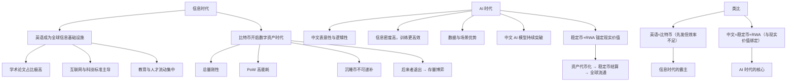

# 摘要

在信息时代，英语凭借先发优势与科技主导，成为全球信息传播与知识生产的核心工具，就像比特币在数字货币中的地位。然而二者都存在结构性缺陷：英语拼写与发音混乱、学习成本高；比特币则总量刚性、挖矿耗能、沉睡币增多，最终演变为存量博弈。

进入 AI
时代，中文展现出更适合作为核心语言的潜力：汉字表意性强、逻辑清晰、信息密度高，学习与推理效率更优；同时，中国拥有庞大的互联网人口和丰富的应用场景，为中文大模型提供了数据与落地优势。这一逻辑类似于稳定币和现实资产代币化（RWA）：不仅继承加密货币的优势，更与现实价值锚定。

因此，英语是信息时代的霸主，而中文有望成为 AI 时代的核心语言。如果说英语是全球化的开路者，那么中文则可能成为智能化的基础语言。

## 一、信息时代：英语的霸主地位

20 世纪下半叶至 21 世纪初，全球化与信息技术革命密不可分。在这一时期，**英语成为信息时代的霸主**：

- **学术与科研**：全球绝大多数科研论文以英语发表，母语非英语的研究者也普遍选择用英语投稿以扩大影响力。
- **互联网基因**：网络协议、搜索引擎、操作系统与主流编程语言多源自英语国家。
- **教育与人才流动**：顶尖高校与研究机构集中在英语国家，强化了英语的中心地位。

因此，在信息时代，英语不仅是沟通工具，更是“信息基础设施”。

## 二、比特币与英语的类比：先发优势与局限

- **比特币（Bitcoin, BTC）**：首个成功的去中心化加密资产，开启数字资产时代。
- **英语**：首个全球扩展成功的通用语言，成为信息社会的“知识底座”。

二者的局限：

- **比特币**
    - **总量刚性**：2100 万枚上限与现实经济脱节；
    - **PoW（Proof of Work，工作量证明）高能耗**：电力消耗保证账本安全，但不直接产生现实价值；
    - **沉睡币不可递补**：遗忘私钥/身故导致的“沉睡货币”增加，流动性下降；
    - **纯量博弈**：后来者风险回报比恶化而退出，市场逐渐演变为存量参与者之间的再分配；
    - **补贴衰减后的两难**：区块奖励趋零 → 依赖交易手续费 → “要么贵/要么脆”。
- **英语**：拼写与发音严重不一致、词汇冗余、学习成本高，更多依赖历史惯性。

**结论**：二者有先发优势，但并非效率最优解。

## 三、AI 时代：中文更适合作为核心

AI 的核心是**语言理解、知识建模与推理生成**。中文的优势：

1. **表意性与逻辑性**：汉字是语义单元，组合规则清晰。
2. **高压缩率与信息密度**：更少字符传递同等信息。
3. **迁移与组合效率**：偏旁部首有助推理，机器学习更高效。
4. **数据与场景优势**：庞大互联网人口和丰富应用为训练提供土壤。

## 四、案例与动向：中文 AI 的快速崛起

- **模型生态**：中国 LLM 数量约占全球三分之一至四成，仅次于美国。
- **代表性成果**：Baichuan-13B、CPM、Qwen 等在中文场景表现突出。
- **研究趋势**：学界持续检验多语言模型在中文处理上的能力。

说明：**中文在 AI 语料与场景上具备领先潜力**。

## 五、RWA 类比：中文是 AI 的“核心货币”

- **稳定币（Stablecoin）与 RWA（Real World Assets，现实资产代币化）**：锚定现实价值，更具落地性。
- **比特币**：稀缺叙事，与现实割裂。

类比：

- **英语 ≈ 比特币**：先发优势，但效率不足。
- **中文 ≈ 稳定币 + RWA**：表意简洁、逻辑自洽，与现实应用深度绑定。

## 六、对比图表：英语/比特币 vs 中文/稳定币 RWA

| 维度       | 英语 / 比特币                           | 中文 / 稳定币 + RWA                       |
|----------|------------------------------------|--------------------------------------|
| **起源角色** | 先发优势，开启信息时代 / 数字货币时代               | 后发优势，适配 AI 时代 / 数字金融基础设施             |
| **价值锚定** | 英语效率受拼写-发音失配制约；比特币总量刚性与经济脱节        | 中文表意与逻辑自洽、组合高效；稳定币+RWA 锚定现实资产与现金流    |
| **效率**   | 英语学习成本高；比特币 PoW 能耗与交易成本高           | 中文信息密度高；稳定币+RWA 支持 T+0 清算与 7×24 跨境结算 |
| **公平性**  | 英语依赖教育资源集中；比特币早期红利、后来者高风险          | 中文识字后迁移效率高；稳定币+RWA 强调储备透明与合规         |
| **可扩展性** | 英语靠历史惯性维持；比特币补贴衰减后“贵/脆”两难          | 中文适配知识图谱与推理；RWA 让现实资产全面代币化、场景可扩展     |
| **未来定位** | 英语：信息时代霸主但 AI 时代效率不足；比特币：数字黄金/投机资产 | 中文：AI 时代核心语言；稳定币+RWA：数字金融基础设施        |

## 七、逻辑演进思维导图

## 八、结论

- **信息时代**：英语依靠先发优势与科技主导，成为无可争议的霸主。
- **AI 时代**：中文凭借表意性、逻辑性、高信息密度与场景优势，更可能成为 AI 的核心语言。

如果说英语是信息全球化的开路者，那么中文则有望成为AI 智能化的基础语言。