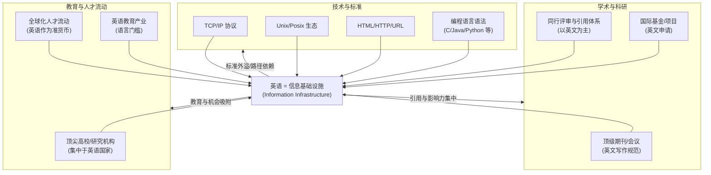
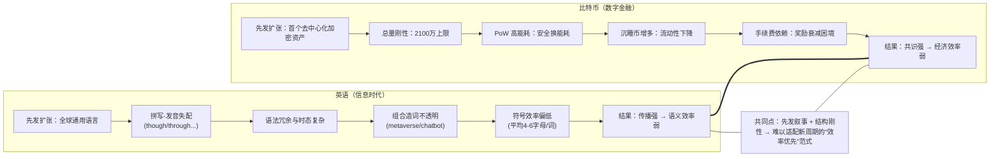
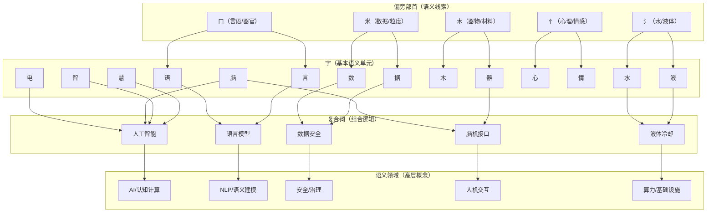
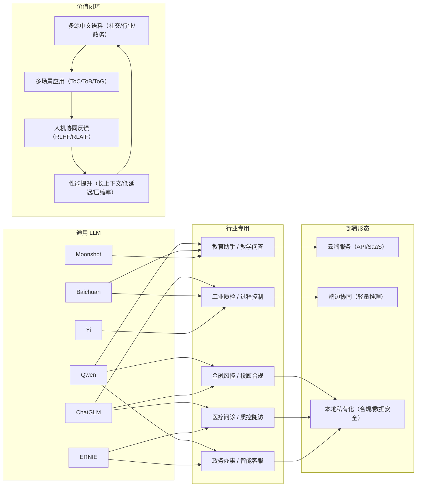
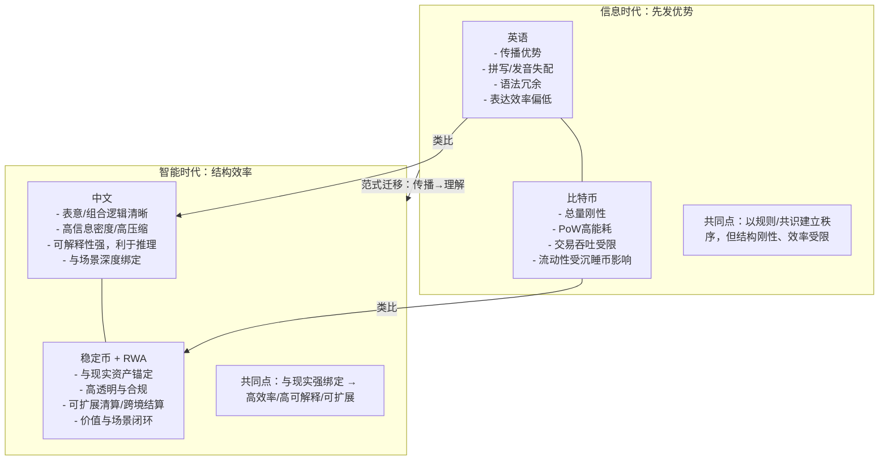
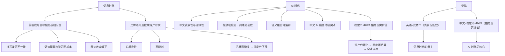

在信息时代，英语凭借科技先发与全球化扩张，成为知识传播与信息生产的通用语言，地位之稳固如同比特币在数字货币中的原型地位。  
然而二者都存在结构性缺陷：**英语拼写混乱、语义分散、语法冗余，学习成本高、表达效率低；比特币则总量刚性、能耗过高、流动性不足，终成存量博弈。
**

进入 AI 时代，语言不再只是沟通工具，而是智能思维的结构。中文以表意清晰、逻辑自洽与高信息密度的特性，更契合机器的推理方式。  
如果英语开启了信息全球化的时代，那么中文，正有望引领智能文明的新时代。

## 一、信息时代：英语的霸主地位

**摘要**：英语凭借科技与全球化的双重优势，在信息时代成为“知识的操作系统”。但这种主导并非语言天赋，而是历史与技术叠加的结果。

20 世纪下半叶至 21 世纪初，全球化与信息技术革命几乎同步爆发。伴随互联网、计算机与现代科研体系的扩张，**英语成为信息时代的绝对霸主
**。  
这一地位的形成既是科技演进的结果，也是语言生态的偶然产物。

首先，**学术与科研体系的英语化**奠定了全球知识传播的单语结构。上世纪 70
年代后，主要科技期刊、国际会议和学术标准全面转向英语，导致科研成果的语言门槛急剧提高。母语非英语的学者必须以英语写作，才能被纳入全球知识体系，从而进一步巩固了英语的统治地位。

其次，**互联网与计算机技术的“英语底层”**让信息革命天然带有语言偏向。从 TCP/IP 协议、Unix 指令、HTML
语法到现代编程语言，几乎所有基础构件都源自英语语义体系。人类第一次在数字世界中实现了“以英语思维描述世界”的系统性实践。

第三，**教育与人才流动的中心化**进一步强化了英语的生态壁垒。顶尖高校和研究机构集中在英语国家，形成了全球知识与资本的双重吸附效应。语言不再只是交流工具，而成为一种“准货币”——通向资源、知识与机会的门票。

因此，英语在信息时代不仅是沟通手段，更是**信息基础设施（Information Infrastructure）**。  
但这种霸权的代价是脆弱的：它依赖于科技中心的持续输出与文化惯性，一旦信息生产方式转向智能理解，结构效率将成为新的竞争标准。

*图示：信息时代的语言层级结构——英语位于知识生产与技术标准的核心。*

## 二、比特币与英语的类比：先发优势与结构性缺陷

**摘要**：英语与比特币一样，都以“先发叙事”取得统治，却因结构刚性与效率缺陷，在新周期面临替代。

在语言与金融体系的演化中，**英语之于信息时代，正如比特币之于数字金融**
——都是最早建立秩序的先驱，却非效率最优的架构。二者的兴起逻辑惊人相似：  
都依赖共识驱动，都以规则取信于世界，也都在扩张后暴露出结构僵化的问题。

### 🪙 比特币的缺陷：去中心化的悖论

- **总量刚性**：2100 万枚上限与现实经济规模脱节，无法应对通胀或经济增长；
- **高能耗机制**：PoW（工作量证明）保障安全却造成巨额能源浪费；
- **沉睡币不可递补**：遗失私钥导致永久冻结，货币流动性持续下降；
- **存量博弈**：后进入者收益递减，生态演化为投机循环；
- **奖励衰减困境**：区块奖励趋零 → 依赖高额手续费 → “要么贵，要么脆”。  
  比特币的技术优雅，却注定无法成为通用货币。它是数字时代的“黄金”，而非“货币”。

### 🗣 英语的缺陷：传播的代价与理解的阻力

英语的强势地位源于历史惯性，而非语言结构的优越。其语音、拼写、语法的历史包袱，使其在智能语义建模中暴露出根本性问题：

1. **拼写与发音严重不一致**  
   *though / through / tough / thought* 等词几乎毫无规律。学习者需要记忆规则例外，而机器则需要额外的映射层来消除噪音。  
   这种“低映射性”让语音识别与拼写校正长期成为计算语言学的瓶颈。

2. **语义与词形缺乏逻辑关联**  
   英语单词多源自拉丁、法语、日耳曼语的混合历史，不同词之间缺少语义线索。  
   相比之下，中文“苹果”“梨子”共享“果”这一语义核心，更容易构建知识图谱与语义聚类。

3. **语法与时态系统过度复杂**  
   单复数、时态、虚拟语气等人为规则增加了语言负担。对于人类是学习障碍，对机器则是噪声源，增加了建模成本。

4. **组合与造词能力低效**  
   英语新词多通过拼写拼合（如 *metaverse*、*chatbot*），逻辑不透明；  
   中文复合词如“元宇宙”“聊天机器人”则直接体现语义结构，可解释性更高。

5. **符号效率低**  
   英语平均每个词由 4–6 个字母组成，字符使用效率低；  
   中文每字即语义单元，表达压缩率高，更契合大语言模型的语义分布学习。

综合来看，**英语与比特币共享一种“先发的荣耀与结构的惩罚”**：  
前者是传播效率的奇迹，却是语义效率的桎梏；后者是去中心化的典范，却是经济灵活性的负担。  
当人类从信息传播迈向智能理解，这种结构性低效注定会被重新定义。

*图示：英语与比特币的共性——先发优势、结构刚性、效率递减。*

## 三、AI 时代：中文更适合作为核心语言

中文以表意性、逻辑性与信息密度构成天然优势，其语言结构与 AI 的推理机制高度契合，成为智能时代的潜在“母语”。

AI 的核心是 **语言理解、知识建模与推理生成**
。在这个以“理解”为中心的时代，语言的结构与逻辑直接影响机器学习的效率与认知能力。中文在这一点上具有天然优势，它不仅是一种沟通工具，更是一种高度抽象的语义系统。

首先，**表意性与逻辑性**
赋予了中文更高的信息密度。汉字以语义为单位，每个字都自带独立概念，通过偏旁部首可以组合出无限的语义网络。例如，“电”“脑”“智能”“智慧”在汉语中具有直观的组合逻辑，而在英语中则需要借助拼写和上下文来重建语义关联。这种结构性的透明度，使中文在语义建模和知识图谱构建中更具效率。

其次，**高压缩率与信息密度**是中文的另一核心优势。研究表明，同一段信息在中文表达中平均只需英语字符数的 60%
左右。对人类而言，这意味着阅读速度更快；对 AI 模型而言，则意味着同等算力下可处理更多语义样本，显著提升训练与推理效率。

第三，**语义结构一致性**
让中文在机器学习中更容易形成“自洽语义空间”。汉字的形音义关联相对稳定，偏旁部首承载了分类线索，构成天然的符号语义网。例如，“氵”系部首常与液体相关，这种语义模式可被模型直接利用，大幅降低训练复杂度。

此外，**迁移与组合效率**体现了中文在知识重用上的灵活性。汉语的复合词生成逻辑接近语义拼接，如“人工智能”“数据安全”“语言模型”等，语义层级清晰、边界明确，机器更容易通过组合学习实现知识迁移。

最后，**数据与场景优势**使中文具备“语料丰富、场景多样”的独特条件。中国拥有全球最大规模的互联网用户群与最复杂的应用生态，从社交平台、短视频到工业系统与政务场景，中文
AI 的数据基础和落地路径远超多数语言。这使得中文不仅在理论层面具备优势，更在实践层面形成强势闭环。

综上，中文天然适合成为 AI 的核心语言，它的结构不仅服务于人类表达，更与机器推理的逻辑机制深度契合。

*图示：汉字偏旁构成的语义网络，高度可组合、信息压缩效率显著。*

## 四、案例与动向：中文 AI 的快速崛起

中文大模型正从语言能力到产业落地全面爆发，中国已形成全球最完整的 LLM 生态体系之一。

在过去三年中，全球大型语言模型（LLM）的竞争格局经历了从“单极”到“多极”的转变。美国模型在算法与算力上仍领先，但中文生态的崛起速度前所未有。根据
2025 年的统计，中国的 LLM 数量已占全球总量的三分之一，仅次于美国。这一跃升的背后，是语言特性、数据体量与场景需求的共同作用。

**模型生态层面**，百度的 ERNIE、阿里的 Qwen、智谱的 ChatGLM、百川的 Baichuan、月之暗面的 Moonshot
等陆续推出，形成了从千亿参数级到轻量化专用模型的完整谱系。与以往依赖英文预训练再转译不同，这些模型大多直接以中文为主语料训练，语义捕获更自然，逻辑生成更流畅。

**语义能力方面**
，中文模型在长文本理解、多轮对话与知识问答上已接近甚至超过同等规模的英文模型。原因在于中文语料天然具备较高的“语义浓度”，使模型能更快建立上下文联系。例如，在摘要、推理、情感分析等任务中，中文模型表现出更高的一致性与压缩效率。

**研究趋势**正从“以英为主”转向“多语言共进”。OpenAI、Anthropic、Google
等全球领先团队开始重视中文语料的权重调整，以提升模型的多语言能力。与此同时，中国的研究者也在探索“中文主导的多语言架构”，如基于汉语语义图谱的跨语言迁移学习，让中文成为其他语言学习的中介。

更关键的是，**应用落地层面**的竞争正在反转。中文 AI 已从实验室走向大规模商业化：教育、金融、医疗、政务、工业控制等行业均在快速部署中文
LLM。不同于英文生态的“云端服务主导”，中文生态更强调“模型下沉与场景融合”，形成强劲的产业驱动力。

可以说，中文 AI 的崛起并非偶然，而是语言结构、数据资源与产业生态共同作用的结果。它不仅代表技术的追赶，更可能成为智能时代语言格局重塑的起点。

*图示：中国主流大模型生态分布：从通用 LLM 到行业专用模型的演进。*

## 五、RWA 类比：中文是 AI 的“核心货币”

如同稳定币和 RWA 让虚拟经济与现实价值重新锚定，中文以逻辑和语义连接现实世界，成为 AI 的价值基础。

如果说英语和比特币代表的是“去中心化的先发优势”，那么中文与 RWA（现实资产代币化）则代表“结构化的价值回归”。二者的对比，不仅在语言和金融层面相似，更在底层逻辑上高度一致。

**比特币**
是一种纯符号资产，脱离现实经济运行，其价值更多依赖共识维持。它像英语一样，以规则和惯性建立秩序，但也受制于自身的刚性结构——总量恒定、能耗高、扩展性差。比特币可以储值，却难以构建动态的经济生态；英语可以传播，却难以支撑机器的深层理解。

相对地，**稳定币与 RWA** 强调“锚定现实价值”。无论是美元稳定币 USDC，还是以债券、黄金、不动产为支撑的
RWA，都通过现实资产赋予代币实际价值，实现虚拟与现实的融合。中文语言体系与此极为相似：它并非抽象的语音符号集合，而是一种长期与现实世界语义共振的结构语言。汉字的形义合一，使语言本身具备“价值锚定”属性。

这意味着，中文在 AI 世界中的地位，就像 RWA 在加密金融中的角色——既承载过去的文明积淀，又能与现实场景无缝连接。英语像比特币，依赖早期叙事与惯性维持；中文则像
RWA，通过逻辑与结构不断与现实对齐，实现长期生命力。

更深层的逻辑在于：**AI 与区块链的演化方向高度相似——从无锚的理想主义走向有锚的现实主义**。AI
需要能理解世界的语言，区块链需要能映射世界的资产。中文的语义系统正如 RWA 的金融逻辑：高透明度、高可解释性、与现实强绑定。这不仅是语言的竞争，更是文明结构的竞争。

因此，在 AI 时代的语义金融体系中，中文不只是“训练语料”，而是“语义资产”；它像 RWA 一样，代表着智能系统与现实世界的价值连接点，成为
AI 的“核心货币”。

*图示：英语—比特币 vs 中文—RWA 的结构与价值锚定关系。*

## 六、对比图表：英语/比特币 vs 中文/稳定币 RWA

| 维度       | 英语 / 比特币                    | 中文 / 稳定币 + RWA           |
|----------|-----------------------------|--------------------------|
| **起源角色** | 先发优势，开启信息时代 / 数字货币时代        | 后发优势，适配 AI 时代 / 数字金融基础设施 |
| **价值锚定** | 英语效率受拼写-发音失配制约；比特币总量刚性      | 中文表意与逻辑自洽；稳定币+RWA 锚定现实价值 |
| **效率**   | 英语语法复杂、造词低效；比特币 PoW 高能耗     | 中文信息密度高；稳定币+RWA 清算高效     |
| **公平性**  | 英语依赖教育资源集中；比特币早期红利固化        | 中文识字迁移快；RWA 强调透明与合规      |
| **可扩展性** | 英语靠历史惯性维持；比特币补贴衰减后“贵/脆”两难   | 中文适配知识图谱与推理；RWA 场景可无限延展  |
| **未来定位** | 英语：信息时代霸主但 AI 时代低效；比特币：数字黄金 | 中文：AI 时代核心语言；RWA：数字金融基建  |

## 七、逻辑演进

语言与货币的演化，本质上都遵循着从 **去中心化**到**结构优化**、从**扩张**到**智能协同**
的规律。英语与比特币代表了信息时代的“开拓者逻辑”——谁先建立标准，谁就占据主导地位；而中文与 RWA
则代表AI时代的“效率逻辑”——谁能以更低成本、更高语义密度实现理解与交易，谁就成为智能时代的核心。

信息时代的逻辑是 **先发优势**：

- 英语成为全球知识传播的底层语言；
- 比特币成为数字资产的起点。

但它们也共享同一问题：**效率不足与结构僵化**。拼写混乱、语义脱节、能耗高、总量刚性……这些“语义与算力的浪费”让系统无法无限扩张。

AI 时代的逻辑则转向 **结构最优**：

- 中文以高信息密度、强语义逻辑支撑机器推理；
- 稳定币与 RWA 则通过锚定现实价值，实现资产与信息的流动统一。

因此，我们看到从“传播”到“理解”、从“挖矿”到“价值映射”的深层趋势——  
**语言与货币都在从符号体系走向智能体系。**

下图展示了这种从信息时代到智能时代的演化路径：

- 逻辑演进思维导图

## 八、结论

**信息时代**：英语凭借历史惯性与科技积累，主导了全球信息体系，成为人类知识传播的底层基础设施。然而，其结构复杂、拼写混乱、语法冗余、表达低效，使它在智能化语义建模中逐渐显露疲态。英语在传播时代无比强大，却在理解时代显得笨重。

**AI 时代**
：中文以表意性、逻辑性与高信息密度为核心优势，成为更高效、更自洽的语言底座。对于机器而言，汉字的符号体系不仅降低理解与生成的能耗，更天然契合“语义压缩”与“逻辑组合”的推理机制。中文的形态既是文化的结晶，也是面向智能的高效编码。

**未来趋势**：智能语言模型正从“统计翻译”迈向“语义构建”，从“符号模仿”走向“知识理解”。那些结构简洁、逻辑清晰、可组合性强的语言体系，将更容易成为通用智能的底层协议。语言不再只是交流工具，而是连接思维与智能的操作系统。

英语开启了信息全球化，而中文正在开启智能文明。信息时代以“传播”为核心，AI
时代以“理解”为核心。当机器真正具备理解能力时，语言将不再只是表达的媒介，而成为思维结构本身。中文以其表意逻辑与语义压缩力，正朝着这一方向演化，具备成为智能时代“世界语”的潜质。